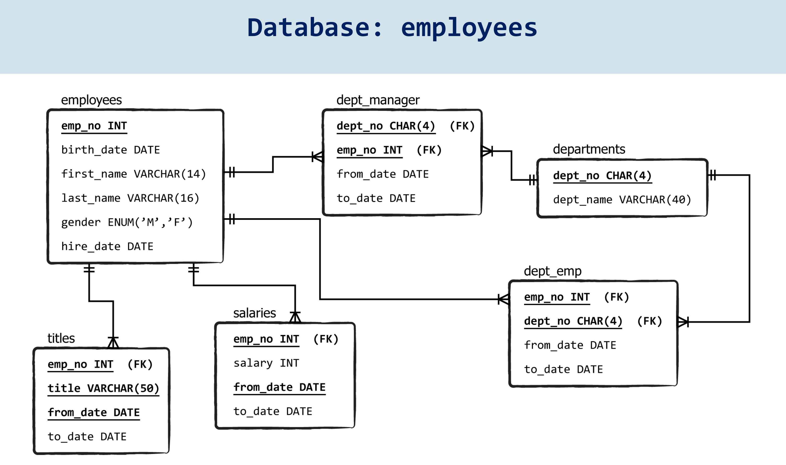
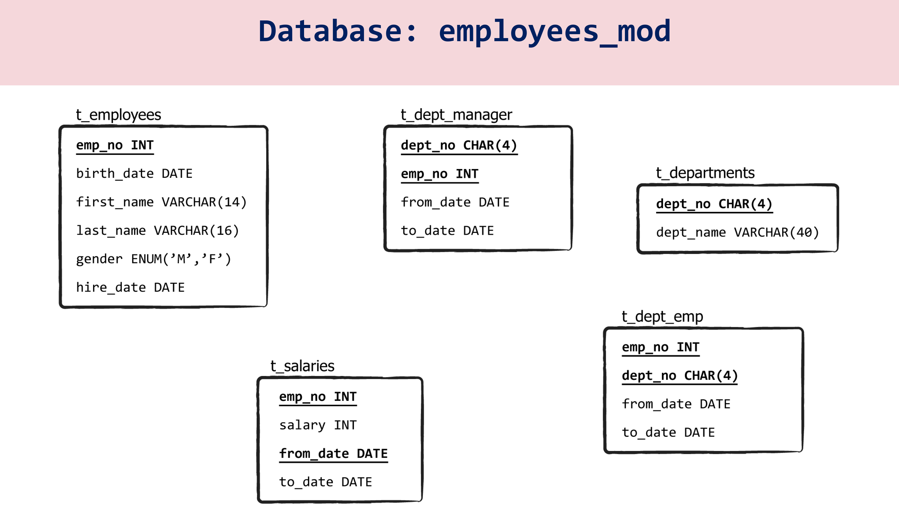
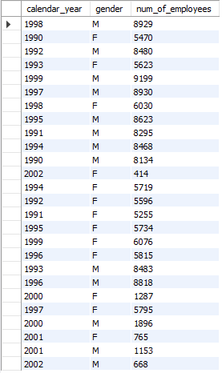
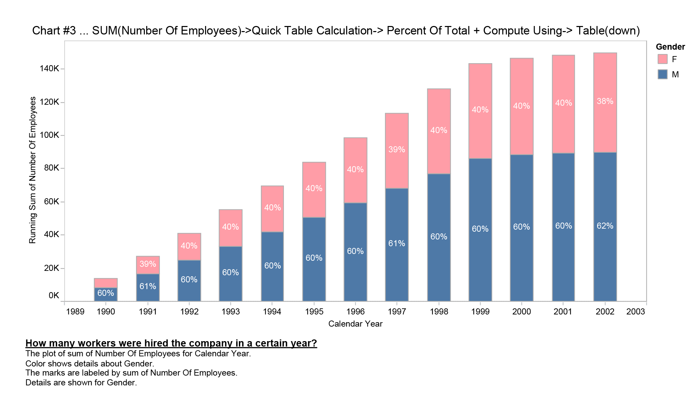
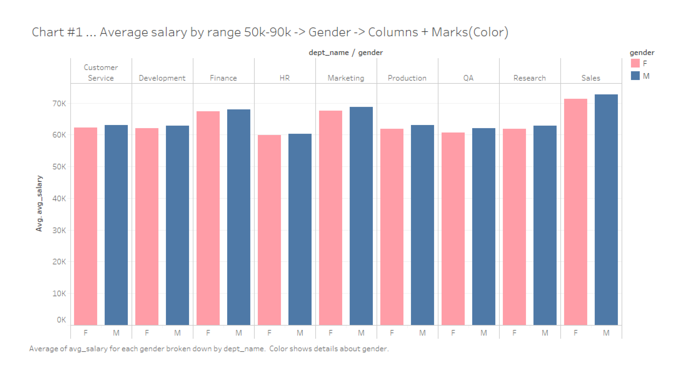

# employees.sql

[employees.sql](https://github.com/tom2kota/employees.sql/blob/main/employees_db.pdf)

- [Download](https://github.com/tom2kota/employees.sql/blob/main/employees.zip) and
  unzip [file with the database](https://github.com/tom2kota/employees.sql/blob/main/employees.zip) named “employees”.

- Once this process is ready, open the script (SQL file) file
  from [Workbench](https://dev.mysql.com/downloads/workbench/).





## Task 1

#### Create a visualization that provides a breakdown between the male and female employees working in the company each year, starting from 1990.

- Run the following query ([download](task_one/task_one.sql)):

```
    SELECT YEAR(d.from_date) AS calendar_year, gender, COUNT(e.emp_no) AS num_of_employees
    FROM t_employees e JOIN t_dept_emp d
    ON d.emp_no = e.emp_no
    GROUP BY calendar_year, e.gender
    HAVING calendar_year >= 1990;
```

- Here’s the output you should obtain after executing the code provided:



- Export data to .csv file ([download](task_one/GenderByYears_task_one.csv))
  or .xls file ([download](task_one/task_one.xls))

- Check the result:
  

--------

## Task 2

#### Compare the number of male managers (M) to the number of female managers (F) from different departments for each year, starting from 1990.

- Run the following query ([download](task_two/task_two.sql)):

``` 
 SELECT 

    d.dept_name,
    ee.gender,
    dm.emp_no,
    dm.from_date,
    dm.to_date,
    e.calendar_year,
    CASE
        WHEN YEAR(dm.to_date) >= e.calendar_year AND YEAR(dm.from_date) <= e.calendar_year THEN 1
        ELSE 0
    END AS active
FROM
    (SELECT 
        YEAR(hire_date) AS calendar_year
    FROM
        t_employees
    GROUP BY calendar_year) e
        CROSS JOIN
    t_dept_manager dm
        JOIN
    t_departments d ON dm.dept_no = d.dept_no
       JOIN 
    t_employees ee ON dm.emp_no = ee.emp_no
ORDER BY dm.emp_no, calendar_year;
```

--------

## Task 3

#### Compare the average salary of female (F) versus male (M) employees in the entire company until year 2002, and add a filter allowing you to see that per each department.


- Run the following query ([download](task_three/task_three.sql)):

``` 
SELECT 
    e.gender,
    d.dept_name,
    ROUND(AVG(s.salary), 2) AS salary,
    YEAR(s.from_date) AS calendar_year
FROM
    t_salaries s
        JOIN
    t_employees e ON s.emp_no = e.emp_no
        JOIN
    t_dept_emp de ON de.emp_no = e.emp_no
        JOIN
    t_departments d ON d.dept_no = de.dept_no
GROUP BY d.dept_no , e.gender , calendar_year
HAVING calendar_year <= 2002
ORDER BY d.dept_no;
```

--------

## Task 4

#### Create an SQL stored procedure that will allow you to obtain the average male (M) and female (F) salary per department within a certain salary range. 
#### Let this range be defined by two values the user can insert when calling the procedure.
#### Finally, visualize the obtained result-set in Tableau as a double bar chart.

- Run the following query ([download](task_four/task_four.sql)):

``` 
DROP PROCEDURE IF EXISTS filter_salary;

DELIMITER $$
CREATE PROCEDURE filter_salary (IN p_min_salary FLOAT, IN p_max_salary FLOAT)
BEGIN
SELECT 
    e.gender, d.dept_name, AVG(s.salary) as avg_salary
FROM
    t_salaries s
        JOIN
    t_employees e ON s.emp_no = e.emp_no
        JOIN
    t_dept_emp de ON de.emp_no = e.emp_no
        JOIN
    t_departments d ON d.dept_no = de.dept_no
    WHERE s.salary BETWEEN p_min_salary AND p_max_salary
GROUP BY d.dept_no, e.gender;
END$$

DELIMITER ;

CALL filter_salary(50000, 90000);
```

- Check the result:
  


--------

- [Download DataGrip page](https://www.jetbrains.com/datagrip/download)
- [Connect to MS SQL server](https://www.jetbrains.com/help/datagrip/db-tutorial-connecting-to-ms-sql-server.html)
- [Configure database connections](https://www.jetbrains.com/help/phpstorm/2020.3/configuring-database-connections.html)
- [Tableau Desktop](https://www.tableau.com/products/desktop/download)
- [TableauDesktop-64bit-2020-4-1.exe](https://downloads.tableau.com/tssoftware/TableauDesktop-64bit-2020-4-1.exe)
- [Tableau Online](https://www.tableau.com/products/cloud-bi)
- [TableauOnlineDesktop-2020-4-1-x64.exe](https://downloads.tableau.com/tssoftware/TableauOnlineDesktop-2020-4-1-x64.exe)
